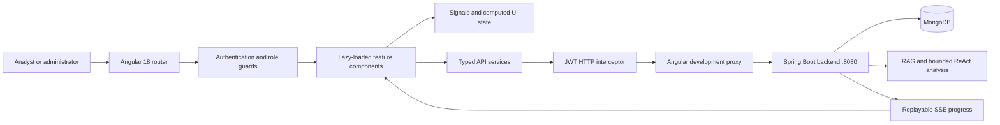
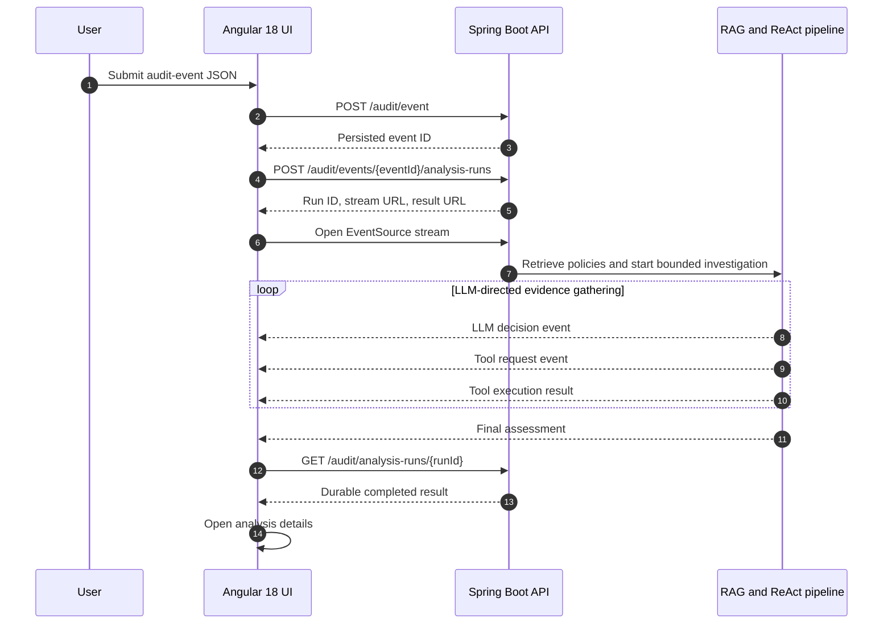

# Agentic AI Audit Observability UI

An enterprise-oriented **Angular 18** application for monitoring audit activity,
submitting suspicious events, observing live LLM-directed investigations, and
reviewing policy-grounded risk assessments.

This repository contains the frontend for the Agentic AI Audit Analysis
Platform. The Spring Boot backend is maintained separately:

https://github.com/Shibaji1987/spring-ai-service

> **Project status:** production-oriented reference implementation. The UI is
> fully connected to the backend APIs and demonstrates authenticated,
> role-aware audit workflows. Review [Production Considerations](#production-considerations)
> before deploying it in a regulated environment.

## Angular 18

The application is built with **Angular 18** and uses modern Angular patterns:

- standalone components instead of NgModules;
- Angular signals and computed state;
- functional HTTP interceptors;
- functional route guards;
- lazy-loaded feature routes;
- built-in control flow such as `@if` and `@for`;
- client hydration and Angular SSR support;
- strict TypeScript models for backend contracts.

Core package versions:

| Package | Version |
| --- | --- |
| Angular | 18 |
| Angular CLI | 18 |
| Angular Material/CDK | 18 |
| TypeScript | 5.4 |
| RxJS | 7.8 |
| AG Grid Community | 35 |
| Tailwind CSS | 3.4 |

## Key Capabilities

- JWT login and session restoration
- Automatic bearer-token injection for HTTP APIs
- Role-aware routes and actions
- Real backend dashboard metrics and insights
- AG Grid audit-event exploration
- JSON audit-event submission
- Persisted asynchronous analysis-run creation
- Live Server-Sent Events investigation progress
- Policy evidence and knowledge-chunk display
- Tool execution trace with inputs, outputs, status, confidence, and timing
- Durable analysis-result retrieval
- Paginated policy catalog
- Policy ingestion for authorized roles
- Knowledge search
- Responsive enterprise shell and navigation
- Loading, empty, forbidden, and backend-error states
- Angular SSR and hydration support

## Application Architecture



## Live Analysis Workflow

The Submit Event screen drives the backend's persisted analysis-run lifecycle:



The UI displays safe reasoning summaries and tool activity. It does not display
or request private model chain-of-thought.

## Main Screens

### Login

- Authenticates through `POST /auth/login`
- Stores the JWT, expiration, username, and roles
- Restores a valid browser session after refresh
- Redirects users to their original protected route after login

### Dashboard

Loads real backend data from `/dashboard/summary`, including:

- total audit events;
- high-risk events;
- AI-analyzed events;
- policy-matched events;
- seven-day trends;
- recent activity;
- generated insights;
- engine and model status.

### Audit Events

Uses **AG Grid Community** to present backend events with:

- sorting;
- filtering;
- resizable columns;
- pagination;
- loading state;
- row navigation to analysis details.

The grid maps nested event and metadata fields into a flat operational view.

### Submit Event

- Accepts and validates audit-event JSON
- Persists the event
- Creates one asynchronous analysis run
- Connects to the returned SSE URL
- Displays pipeline phases in real time
- Shows selected policy evidence
- Shows each model-requested tool execution
- Navigates to the durable final result

### Knowledge Base

- Browses a paginated policy catalog
- Filters by title and source type
- Displays policy details
- Searches embedded knowledge chunks
- Allows `ADMIN` and `POLICY_MANAGER` users to ingest documents

### Analysis Details

Displays:

- risk score and category;
- confidence;
- grounded/fallback status;
- summary and recommended action;
- reasons and tags;
- original event metadata;
- selected policy evidence;
- tool execution trace;
- analysis diagnostics.

## Role-Based Access

The backend remains the authority for authorization. Frontend guards and hidden
actions improve usability but are not security boundaries.

| Role | UI access |
| --- | --- |
| `ADMIN` | Full UI access |
| `POLICY_MANAGER` | Dashboards, events, analysis results, policy browsing, ingestion, and search |
| `ANALYST` | Dashboards, events, event submission, investigations, policy browsing, and search |
| `VIEWER` | Read-only dashboards, events, policies, and analysis results |

The `/submit-event` route is restricted to `ADMIN` and `ANALYST`.

## Technology Stack

- Angular 18
- Standalone Angular components
- Angular signals and computed state
- Angular Router
- Angular HttpClient
- RxJS
- Angular SSR and hydration
- AG Grid Community
- Tailwind CSS
- Jasmine and Karma

## Prerequisites

- Node.js 18.19 or newer
- npm 9 or newer
- The Spring Boot backend running on `http://localhost:8080`

The backend additionally requires MongoDB and an OpenAI API key. Follow its
README before starting the UI.

## Install and Run

```powershell
git clone https://github.com/Shibaji1987/agentic-ai-audit-observability-ui.git
cd agentic-ai-audit-observability-ui
npm install
npm start
```

Open:

http://localhost:4200

The Angular development server uses `proxy.conf.json` to forward backend
requests to `http://localhost:8080`.

## Development Proxy

| Frontend path | Backend path |
| --- | --- |
| `/auth/**` | `/auth/**` |
| `/audit/**` | `/audit/**` |
| `/api/knowledge/**` | `/knowledge/**` |
| `/api/dashboard/**` | `/dashboard/**` |
| `/ai/**` | `/ai/**` |

Using relative API paths keeps backend addresses out of feature components and
avoids development CORS configuration.

## Development Login

The default analyst credentials supplied by the backend are:

```text
Username: analyst
Password: Analyst@12345
```

These credentials are development defaults and may be overridden by backend
environment variables. Never use the default passwords in a shared or
production environment.

## Authentication Design

`AuthService` stores this session structure in browser `localStorage`:

```json
{
  "accessToken": "JWT",
  "expiresAt": "2026-06-14T12:00:00Z",
  "username": "analyst",
  "roles": ["ANALYST"]
}
```

The functional HTTP interceptor attaches:

```http
Authorization: Bearer JWT
```

to protected HTTP requests.

Native browser `EventSource` cannot set arbitrary authorization headers. For
the SSE analysis stream, the UI supplies the token through the backend-supported
`access_token` query parameter. Use short-lived tokens, HTTPS, strict log
redaction, and an alternative cookie or ticket-based stream design before
deploying this pattern broadly.

## Backend API Usage

Primary API services:

| Service | Backend operations |
| --- | --- |
| `AuthService` | Login and session management |
| `AuditApiService` | Submit and retrieve audit events |
| `AnalysisApiService` | Create, stream, poll, and retrieve analysis runs |
| `DashboardApiService` | Dashboard summary and engine status |
| `KnowledgeApiService` | Policy catalog, ingestion, and search |

The recommended investigation lifecycle is:

1. `POST /audit/event`
2. `POST /audit/events/{eventId}/analysis-runs`
3. `GET /audit/analysis-runs/{runId}/stream`
4. `GET /audit/analysis-runs/{runId}`

## Project Structure

```text
src/app
|-- core
|   |-- guards       Authentication and role route guards
|   |-- models       Typed API and UI contracts
|   |-- services     HTTP, authentication, and streaming services
|   `-- state        Signal-based feature stores
|-- features
|   |-- analysis-details
|   |-- audit-events
|   |-- dashboard
|   |-- forbidden
|   |-- knowledge
|   |-- login
|   `-- submit-event
|-- layout           Application shell, header, and sidebar
`-- shared/ui        Reusable badges, evidence cards, traces, and JSON viewer
```

## Build

Create a production build:

```powershell
npm run build
```

Output:

```text
dist/agentic-ai-audit-observability-ui
```

The build includes browser and server bundles because Angular SSR is enabled.

Serve the generated SSR application:

```powershell
npm run serve:ssr
```

## Tests

```powershell
npm test
```

Run a development watch build:

```powershell
npm run watch
```

## Current Warnings

The production build currently succeeds with known non-blocking warnings:

- the initial bundle exceeds the configured warning budget;
- AG Grid may emit a selector-related warning during compilation.

These should be addressed before setting strict CI quality gates.

## Production Considerations

Before production deployment:

1. Replace development users with enterprise OIDC/OAuth2 authentication.
2. Prefer secure, `HttpOnly`, `SameSite` cookies or a hardened backend-for-
   frontend session design over long-lived JWTs in `localStorage`.
3. Replace query-string SSE tokens with short-lived stream tickets or
   cookie-authenticated streaming.
4. Configure HTTPS and production API routing at the reverse proxy.
5. Add Content Security Policy, Trusted Types, and security headers.
6. Add centralized error telemetry and OpenTelemetry browser tracing.
7. Add end-to-end tests for authentication, RBAC, SSE reconnects, and failed
   analysis runs.
8. Add accessibility audits and keyboard testing for grids and dialogs.
9. Add virtualized/server-side pagination when event volume grows.
10. Split large feature bundles and enforce bundle budgets in CI.
11. Add environment-specific deployment configuration.
12. Add dependency, license, and supply-chain scanning.

## Suggested Roadmap

- Investigation case management
- Analyst comments, assignments, and dispositions
- Saved AG Grid filters and column layouts
- Server-side grid sorting, filtering, and pagination
- Correlated entity timelines
- Attack-path and relationship visualization
- MITRE ATT&CK mapping
- Analysis replay and model comparison
- Human feedback and false-positive labeling
- Prompt/model version visibility
- Cost, token, and latency analytics
- Notifications and incident-platform integrations
- Dark/light theme preference
- WCAG 2.2 AA validation

## Troubleshooting

### Login reports authentication service unavailable

Confirm the backend is running on port `8080` and that `/auth/login` is
available.

### Protected APIs return 401

Sign in again and verify the JWT has not expired. Check that the backend and UI
use matching role names.

### Dashboard or policies do not load

Verify `proxy.conf.json` is active through `npm start` and confirm the backend
dashboard and knowledge endpoints are healthy.

### Analysis stream fails

Confirm:

- the run was created successfully;
- the returned `streamUrl` is used unchanged;
- the JWT is still valid;
- the backend supports the `access_token` query parameter;
- no reverse proxy is buffering SSE responses.

### Direct browser refresh returns 404 after deployment

Configure the web server to route Angular paths to the SSR server or application
entry point.

## Responsible Use

This UI presents AI-assisted audit findings to qualified users. It should not
autonomously make employment, disciplinary, legal, access-removal, or regulatory
decisions. Preserve evidence, expose uncertainty, and require human review for
consequential actions.

## License

Add an explicit repository license before distributing the project or accepting
external contributions.
